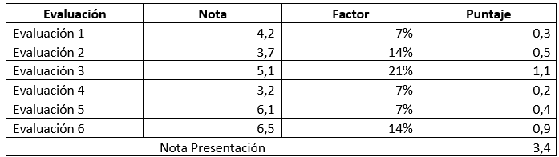

## 001

Introducción a la programación orientada a objetos

- Para realizar el cálculo de la nota de presentación a un examen, cada nota parcial se multiplica por un factor específico.
- El resultado de la multiplicación se va acumulando hasta conformar un total que corresponde a la nota de presentación al examen.
- Si la sumatoria acumulada es superior a un determinado valor, entonces el alumno tiene derecho a dar el examen. Si no, la sumatoria acumulada corresponde a la nota final.
- En el siguiente cuadro de ejemplo:

Dado el caso expuesto y considerando un desarrollo en JAVA, ¿Qué tipos de datos y que  operador aritmético-lógico debería utilizar dentro del programa para procesar las notas, obtener el promedio y verificar si el valor permite que el alumno pueda dar examen?

Fuente: UNIVERSIDAD IPCHILE - MENCIÓN ANALISTA PROGRAMADOR COMPUTACIONAL - ASIGNATURA: PROGRAMAC. ORIENTADA A OBJETOS.